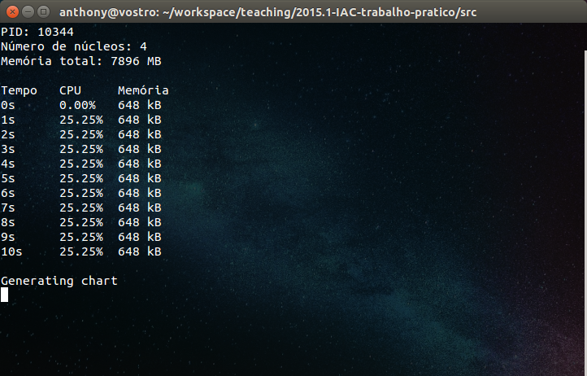
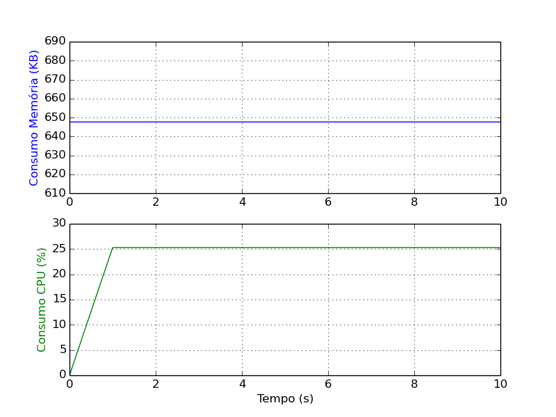
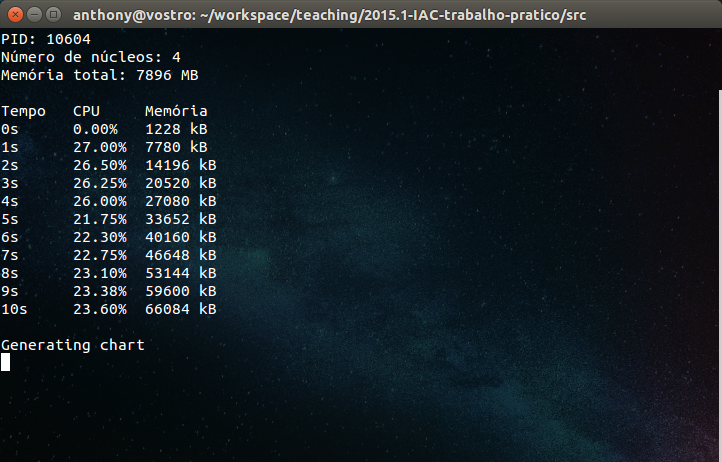
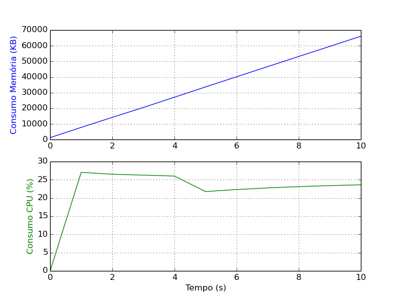

# Identificação

* Página do repositório do trabalho ([link GitHub](https://github.com/ninguem26/teaching)) 

* Discente 1
	* Anthony Emanoel de Albuquerque Jatobá
	* 15111580
* Discente 2
	* Júlio César Ferreira Silva de Holanda
	* 15111981

# Discussão 

## Utilização intensa da UCP

No primeiro caso, avalia-se o comportamento do programa enquanto é executado um código exigente em termos de processamento. O código, que consiste apenas de um loop infinito, mantém o processador em estado ativo durante sua execução:

```c
void consumeCPU() {
	for (;;) {}
}
```

A execução do programa com o parâmetro ```cpu``` gerou a seguinte saída:



Foi gerado um gráfico com o pacote [PyPlot](https://github.com/stevengj/PyPlot.jl) para [Julia](http://julialang.org/). O gráfico permite uma melhor análise dos resultados obtidos:



### Uso de memória

Percebe-se que o uso de memória manteve-se constante do início ao fim da execução do código. Isso se deve ao fato de que o programa não realiza alocações de memória durante sua execução.

### Uso de UCP

Já o uso de UCP tem um comportamento mais interessante:

No instante 0 o uso da UCP pelo processo filho é de 0%, pois o mesmo ainda não executou a função ```consumeCPU()```.

Após um segundo de execução, o processador atinge a marca de aproximados 25%. O processador usado no experimento possui 4 núcleos lógicos, dos quais apenas um é completamente usado pelo programa, daí o valor.

Essa porcentagem é mantida até o final da execução, o que indica que houve poucas ou nenhuma interrupção durante a execução do programa. Caso houvesse outros processos CPU-bound em execução, o sistema operacional poderia escalonar o uso dos recursos, apresentando um comportamento distinto do apresentado.

## Utilização intensa da UCP e memória
O segundo caso, por sua vez, exige uso intenso tanto da UCP, quanto da memória.

### Adaptando função para uso intenso de UCP e Memória

Para realizar esta parte do experimento o seguinte trecho de código foi provido:

```c
for(;;){
	malloc(sizeof(100000));
}
```

Este código garante uso intenso da UCP através do ```for loop``` infinito, ao mesmo tempo que aloca rapidamente memória, intensificando o uso da mesma.
Porém, seu uso apresenta certos sintomas colaterais para o funcionamento da máquina que o executa, sendo o mais agravante o travamento da máquina após ter alocado uma quantidade considerável de RAM. Para contornar este problema foi reduzida a quantidade de memória a ser alocada pelo ```malloc()``` e foi adicionada a função ```usleep()``` ao código. Esta função pausa a thread que a executa por um tempo ‘x’ em milissegundos. O novo código:

```c
for(;;){
	malloc(1024);
	usleep(100);
}
```

Agora o loop passou a alocar apenas 1024 bytes a cada 100ms. No entanto os resultados passaram a apresentar uma redução no consumo da UCP ao executar este trecho do código. Isso passou a ocorrer por conta do ```usleep()```, pois ao pausar o processo por um curto período de tempo, a UCP deixa de executá-lo.
Deste modo, para manter o consumo de UCP, foi criada uma thread exclusivamente para chamar a função ```*consumeUCP_thread(void *threadid)```. Esta função é semelhante a ```consumeUCP()```, no entanto ela recebe um ponteiro como parâmetro, que é o id da thread. O código da função e do loop passaram a ser assim:

```c
void *consumeUCP_thread(void *threadid)
{
  for(;;){}
}

void consumeMemory() {
	for(;;){
		pthread_t thread;
		pthread_create(&thread, NULL, consumeUCP_thread, (void *)1);

		malloc(1024);
		usleep(100);
	}
}
```

Desta maneira o consumo de UCP manteve-se intenso ao executar o código, mesmo com o ```usleep()```. O loop foi implementado em uma função ```consumeMemory()```.

Com a função para consumo intenso de UCP e memória implementada, o código foi executado mais uma vez e o resultado obtido pode ser conferido na imagem abaixo:



Estes dados ilustram o seguinte gráfico, plotado em Julia com o PyPlot:



### Uso de Memória
O comportamento do consumo de memória mostra-se uma reta contínua ascendente do começo ao fim da execução. Isso deve-se ao fato de que, a cada loop, a quantidade de memória alocada é sempre a mesma, 1024 bytes.

É possível também notar que o valor inicial de memória não é 0 KB, como o de UCP que é 0%, e sim 1228 KB, que é a quantidade de memória que o processo ocupa ao ser chamado para execução.

### Uso de UCP
A UCP, por sua vez, apresenta um comportamento mais variado. Como foi explicado anteriormente, seu valor inicial é de 0% devido a chamada da função ```consumeMemory()``` ainda não ter sido efetuada.

A partir do instante 1, os valores passam a variar entre 21.75% e 27%. Essa variação pode ocorrer devido a outros processos em execução que necessitavam de uso do processador.
