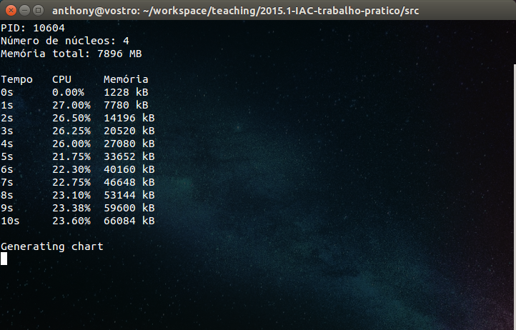

# Identificação

* Página do repositório do trabalho ([link GitHub](https://github.com/ninguem26/teaching)) 

* Discente 1
	* Anthony Emanoel de Albuquerque Jatobá
	* 15111580
* Discente 2
	* Júlio César Ferreira Silva de Holanda
	* 15111981

# Discussão 

## Utilização intensa da UCP

No primeiro caso, avalia-se o comportamento do programa enquanto é executada uma tarefa exigente em termos de processamento. O código, que consiste apenas de um loop infinito, mantém o processador em estado ativo durante sua execução:

```c
void consume_cpu() {
	for (;;) {}
}
```

A execução do programa com o parâmetro ```cpu``` gerou a seguinte saída:


Foi gerado um gráfico com o pacote [PyPlot](https://github.com/stevengj/PyPlot.jl) para [Julia](http://julialang.org/). O gráfico permite uma melhor análise dos resultados obtidos:


### Uso de memória

Percebe-se que o uso de memória manteve-se constante do início ao fim da execução do código. Isso se deve ao fato de que o programa não realiza alocações de memória durante sua execução.

### Uso de UCP

Já o gráfico de UCP apresenta um comportamento mais interessante:

No instante 0 o uso da UCP pelo processo filho é de 0%, pois o mesmo ainda não executou a função ```consume_cpu()```.

Após um segundo de execução, o processador atinge a marca de aproximados 25%. O processador usado no experimento possui 4 núcleos lógicos, dos quais apenas um é completamente usado pelo programa, daí o valor.

Essa porcentagem é mantida até o final da execução, o que indica que houve poucas ou nenhuma interrupção durante a execução do programa. Caso outros processos solicitassem uso de UCP durante a execuçãoexecução, o sistema operacional poderia administrar o uso dos recursos, apresentando valores e gráfico distintos do apresentado.

## Utilização intensa da UCP e memória
O segundo caso, por sua vez, exige uso intenso tanto da UCP quanto da memória.

### Adaptando a função para uso intenso de UCP e Memória

Para realizar esta parte do experimento, o seguinte trecho de código foi sugerido:

```c
for(;;){
	malloc(sizeof(100000));
}
```

Este código garante uso intenso da UCP através do ```for loop``` sem condição de parada, ao mesmo tempo que aloca rapidamente memória, intensificando o uso da mesma.

Em nossas execuções o trecho causou travamento do computador, por alocar rapidamente toda a memória disponível. O mesmo foi percebido pelos colegas de curso. Para contornar este problema, o total de memória a ser alocada foi limitado pela função ```usleep()```, que gera interrupções em milissegundos ao processador, que agora solicita alocação de memória numa frequência muito menor que antes:

```c
for(;;){
	malloc(1024);
	usleep(100);
}
```

Agora o código aloca uma quantidade bem menor de memória, numa progressão constante. No entanto, os resultados passaram a apresentar uma redução no consumo da UCP por conta do ```usleep()```, que interrompe a execução do processo pela UCP. 

Para manter a alta carga de processamento, foi criada uma thread para usar o processador enquanto o processo filho segue alocando memória. A thread usa a função ```*consume_cpu_thread(void *threadid)```, que é uma adaptação da ```consume_cpu()``` para o uso da thread.

```c
void *consumeUCP_thread(void *threadid)
{
  for(;;){}
}
```

```c
void consumeMemory() {
	for(;;){
		pthread_t thread;
		pthread_create(&thread, NULL, consumeUCP_thread, (void *)1);

		malloc(1024);
		usleep(100);
	}
}
```

Desta maneira o consumo de UCP manteve-se intenso durante a execução do código.

Com a função para consumo intenso de UCP e memória implementada, o código foi executado com o parâmetro ```cpu-mem``` e o resultado obtido pode ser conferido na imagem abaixo:



Estes dados são ilustrados pelo seguinte gráfico:


### Uso de Memória
O comportamento do consumo de memória é de uma reta ascendente. Isso deve-se ao fato de que, a cada loop, a quantidade de memória alocada é constante: 1024 bytes.

É possível também notar que o valor inicial de memória não é 0 KB, como o de UCP que é 0%, e sim 1228 KB, que é a quantidade de memória que o processo ocupa ao ser chamado para execução.

### Uso de UCP
A UCP, por sua vez, apresenta um comportamento inconstante. Como foi explicado anteriormente, seu valor inicial é de 0% devido a chamada da função ```consumeMemory()``` ainda não ter sido efetuada.

A partir do instante 1, os valores passam a variar entre 21.75% e 27%. Essa variação pode ocorrer devido a outros processos em execução que necessitavam de uso do processador.

#Funcionalidades extras

- Código e comentários em inglês;
- Resultado da execução armazenado em arquivo (log.txt);
- Funcionalidades de geração de gráfico:
  - Script Julia para geração de gráficos usando PyPlot;
  - Parâmetro ```plot``` que solicita a geração do gráfico;
    - Exemplo: ``` ./main cpu-mem plot```
  - Todos os gráficos gerados são salvos no diretório ```plots```, ordenados por data;
